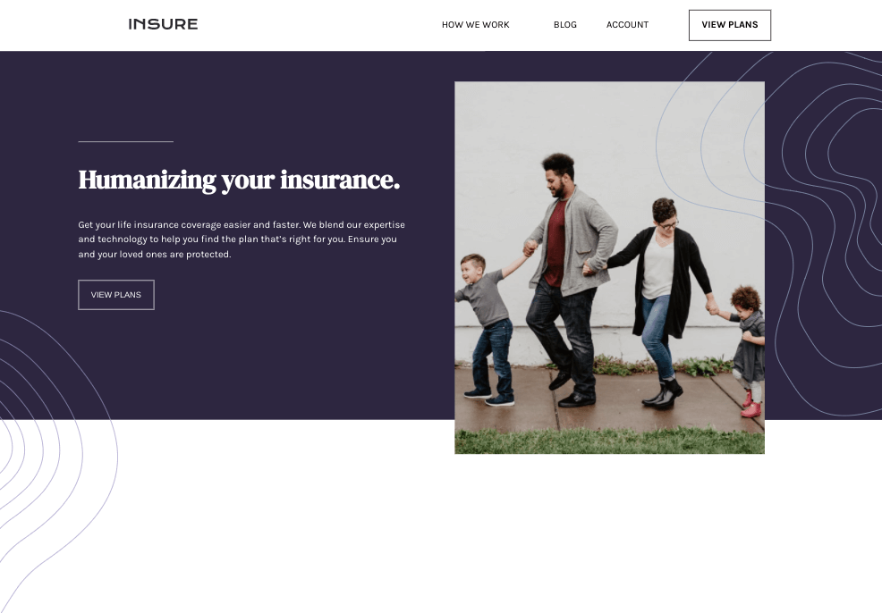
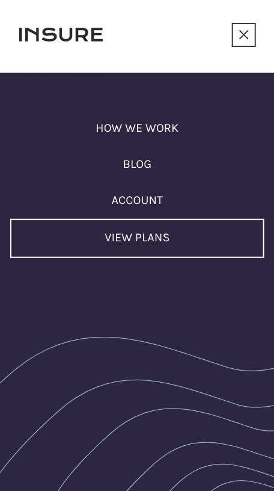

# Frontend Mentor - Insure landing page solution

This is a solution to the [Insure landing page challenge on Frontend Mentor](https://www.frontendmentor.io/challenges/insure-landing-page-uTU68JV8). Frontend Mentor challenges help you improve your coding skills by building realistic projects.

## Table of contents

- [Overview](#overview)
  - [The challenge](#the-challenge)
  - [Screenshot](#screenshot)
  - [Links](#links)
- [My process](#my-process)
  - [Built with](#built-with)
  - [What I learned](#what-i-learned)
  - [Continued development](#continued-development)
  - [Useful resources](#useful-resources)

## Overview

### The challenge

Users should be able to:

- View the optimal layout for the site depending on their device's screen size
- See hover states for all interactive elements on the page

### Screenshot

### Links

- Live Site URL: [Github Pages](https://jdegand.github.io/insure-landing-page)

## My process

- Did mobile/desktop conversion of each section versus completing a full mobile/desktop layout and then converting.
- This helped lessen mistakes and reduced margin/padding forget.

### Built with

- Semantic HTML5 markup
- CSS custom properties
- Flexbox
- CSS Grid
- Mobile-first workflow

### What I learned

- Bold on Hover causes layout shift.

### Continued development

- Accessibility

### Useful resources

- [MDN Docs](https://developer.mozilla.org/en-US/docs/Web/HTML/Element/picture) - Picture element
- [CSS Tricks](https://css-tricks.com/bold-on-hover-without-the-layout-shift/) - Bold on Hover
- [Stack Overflow](https://stackoverflow.com/questions/5777210/how-to-write-hover-condition-for-abefore-and-aafter) - Hover and Pseudo
- [Codepen](https://codepen.io/sosuke/pen/Pjoqqp) - CSS filter generator
- [W3 Schools](https://www.w3schools.com/colors/colors_converter.asp) - CSS Color Converter
